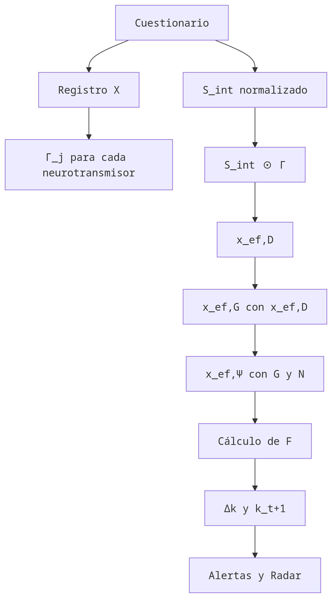

# Conatus v4.7: Cartografía de la Potencia y Resiliencia

> Autor: Fabián Catalán

**Documento de Especificación Técnica, Psicométrica y Fenomenológica**

Este modelo describe la capacidad de un sujeto para perseverar en su ser (*Conatus*), integrando principios de psiquiatría computacional, dinámica de sistemas biológicos y psicometría validada.

---

## 1. Arquitectura de Entrada (Inputs)

El sistema opera sobre dos niveles de realidad: la **Potencia Fluida** ($S_{int}$) y la **Estructura del Modo** ($\Theta$).

### A. El Vector de Estado Interno ($S_{int}$)
Representa los recursos endógenos.
$$\mathbf{S}_{int} = [D, N, G, Glu, S, O, ACh, C, M, E, I]$$

### B. Estructura del Modo ($\Theta$)
Variable de dinámica lenta que representa la resiliencia sedimentada.
$$\Theta = k$$

> **Nota Spinozista:** $S_{int}$ es el *afecto* (lo que siento ahora), mientras que $k$ es la *esencia* actual (lo que soy capaz de sostener).

### C. Normalización de Variables
Para garantizar la consistencia matemática, todos los inputs subjetivos (1-10) se normalizan a un rango $[0, 1]$ antes de procesarse:
$$S_{norm} = \frac{S_{raw} - 1}{9}$$

---

## 2. Cuestionario Psicométrico (Índices Compuestos)

Siguiendo los principios de *Furr & Bacharach*, no confiamos en ítems únicos. Usamos **Índices Compuestos** (promedio de ítems correlacionados) para reducir la varianza del error.

*Cada respuesta es 1-10. El input final es el promedio del clúster.*

### CLÚSTER 1: Sustento Basal ($M, E, I$)
* **Reparación (M):**
    1.  Calidad subjetiva del sueño.
    2.  Sensación de frescura al despertar.
* **Energía (E):**
    1.  Nivel de combustible físico.
    2.  Disponibilidad de glucosa/hambre.
* **Coherencia (I):**
    1.  Alineación de acciones con propósito.
    2.  Sensación de sentido/significado hoy.

### CLÚSTER 2: Conquista y Motor ($D, N, ACh$)
* **Impulso (D):**
    1.  Ganas de iniciar (Appetitive Salience).
    2.  Expectativa de disfrute (Reward Prediction).
* **Tensión (N):**
    1.  Urgencia/Presión física.
    2.  Incapacidad para relajarse.
* **Plasticidad (ACh):**
    1.  Facilidad para cambiar de tarea.
    2.  Apertura a nueva información.

### CLÚSTER 3: Filtro y Regulación ($G, Glu$)
* **Freno (G):**
    1.  Control de impulsos.
    2.  Capacidad de "no hacer".
* **Ruido (Glu):**
    1.  Velocidad de pensamiento.
    2.  Intrusividad de ideas (Rumiación).
* **Enfoque ($\Psi$):**
    1.  Claridad en resolución de problemas.
    2.  Estabilidad atencional.

### CLÚSTER 4: Arraigo ($S, O, C$)
* **Seguridad (S):**
    1.  Sensación de estatus/competencia.
    2.  Confianza en el futuro inmediato.
* **Vínculo (O):**
    1.  Conexión social sentida.
    2.  Percepción de apoyo externo.
* **Capacidad de Carga (C):**
    1.  Resistencia al estrés extra.
    2.  "Espalda" emocional disponible.

### CLUSTER 5: Registro de Afecciones Externas ($X$)

#### Mapeo de perturbadores y farmacocinética.

**Para cada sustancia** o intervención consumida en las últimas 24 horas, registrar:

- **Identificador (Sustancia)**: (Ej: Cafeína, Teanina, Alcohol, Nicotina, etc.)
- **Magnitud (Dosis)**
  * Micro/Baja (0.3): Efecto apenas perceptible
  * Estándar/Media (0.6): Dosis funcional habitual
  * Saturación/Alta (1.0): Dosis máxima tolerada o exceso
- **Cronometría (Texp​):** Horas transcurridos desde la ingesta
- **Expectativa de Disfrute (para δRPE​):** ¿Qué tanto impacto esperabas que tuviera? (1-10)

> **Nota Spinozista sobre $X$**: Esta sección registra las "Pasiones": cómo el cuerpo es afectado por otros cuerpos. El objetivo de capturar $T_{exp}$​ es entender cuándo la "servidumbre" a la sustancia termina y el Conatus vuelve a su autonomía estructural.

---

## Tabla de sustancias escogibles por el usuario

| Sustancia | Eje Primario (β>1) | Eje Secundario / Bloqueo (β<1) | λ (Vida Media aprox.) |
|-------------|-------------|------------------------------|------------------------|
| Cafeína       | $N (x1.4)$, $D$ (x1.2) | $M$ (x0.3 - Bloqueo Adenosina) | $0.14h−1 (5h)$ |
| Nicotina      | $ACh (x1.5)$,  $D$ (x1.1) | $N$ (x1.2) | $0.35h−1 (2h)$ |
| L-Teanina     | $G (x1.3)$   |  $N$ (x0.8 - Atenuación) | $0.23h−1 (3h)$ |
| Magnesio      | $G (x1.2)$,  $S$ (x1.1) | $Glu$ (x0.9 - Filtro NMDA) | $0.03h−1 (24h)$ |
| Alcohol       | $G (x1.6)$   |  $Ψ$ (x0.4) x $ACh$ (x0.5), $M$ (x0.2) | $0.46h−1 (1.5h*)$ |
| Triptófano    | $S (x1.4)$   |  $D$ (x0.9 - Competencia BHE) | $0.17h−1 (4h)$ |
| Grasas/Keto   | $Ψ (x1.2)$,  $C$ (x1.1) | $E$ (x0.9 - Digestión lenta) | Variable |
| Carbohidratos | $E (x1.5)$,  $S$ (x1.2) | $Ψ$ (x0.8 - Niebla post-prandial) | $0.69h−1 (1h)$ |

## 3. El Motor Matemático: Computación de Estado

### Refinamiento de Cómputo y RPE

### 1. Orden de Computación (Algoritmo de Estado)
  Para evitar inconsistencias matemáticas, el software debe procesar las variables en un orden estrictamente secuencial. No se pueden calcular todas en paralelo porque los neurotransmisores modulan la efectividad de otros.

  #### Secuencia de ejecución:
  
  - Cálculo de $Γ_j$​: Se computa el impacto de cada sustancia externa sobre cada neurotransmisor base (N,D,G,Ψ,…) usando el decaimiento exponencial.
  - Cálculo de $x_{ef},D$​ (Impulso): Es la primera variable operativa. Depende de la Tensión ya deformada (N⋅ΓN​).
  - Cálculo de $x_{ef},G$​ (Filtro): Depende de la Dopamina ya calculada ($x_{ef},D$D​) para aplicar el factor de impulsividad $α$.
  - Cálculo de $x_{ef},Ψ$​ (Enfoque): Utiliza los valores finales de ruido y tensión.

### 2. Formalización de la Dopamina Efectiva (xef,D​)

  La dopamina efectiva se define como:
  
  $$x_{ef},D​= max(0, (D_{compuesto}​+\delta_{RPE}​)⋅Γ_D​⋅(1−0.2(N⋅Γ_N​)))$$
  
  Donde ($N⋅Γ_N$​) representa la Tensión Efectiva que modula el impulso hacia la acción o la huida.
  > Nota: Considerando el caso donde $\delta_{RPE} = -1$ (máxima decepción) y $D=0$, se obtiene un impulso negativo, para ello usamos un **clamp**, es decir, el maximo entre 0 y el valor definido.
### 3. El Ciclo de Recompensa: Protocolo Pre/Post

  Para que $δ_{RPE}$​ tenga validez psicométrica (Furr & Bacharach), el cuestionario se divide en dos momentos de captura:

  Fase A: Pre-Acción (Expectativa)
  - Input $D_{exp}$​: "¿Qué tanto disfrute o recompensa esperas de tu actividad actual?" (1-10).

  Fase B: Post-Acción (Resultado)
  - Input $D_{real​}$: "¿Qué tanto disfrutaste o qué tan efectiva fue la recompensa realmente?" (1-10).

#### ¿Cuándo se ejecuta la fase de Post-Acción?
  1. El usuario completa una actividad (trabajo, ejercicio, socialización).
  2. Al finalizar, el sistema pide: "Evalúa el resultado real: ¿Qué tan efectivo fue?"
  3. Se compara con la expectativa guardada de Fase A.

  ### Ecuación de Error de Predicción (RPE):
  $$δ_{RPE}​=D_{real}​−D_{exp}​$$

  - Impacto en el Conatus: 
  > * Si $δ_{RPE}​>0$: El sistema experimenta un aumento de la potencia de obrar (Dopamina fásica).
  > - Si $δ_{RPE}​<0$: Se produce un "Dopamine Crash" por decepción, lo que aumenta la Fragilidad ($F$) en el siguiente ciclo.

## Diagrama de flujo computacional

### A. Vector de Deformación ($\mathbf{\Gamma}$)
Calculado con decaimiento fisiológico exponencial (*Keener & Sneyd*).

$$\mathbf{\Gamma}_j(X) = 1 + \sum_{i} \beta_{ij} \cdot \text{Dosis}(X_i) \cdot e^{-\lambda_i T_{exp}}$$

* **Parámetro $\lambda$:** Ajustado a farmacocinética real (ej. Cafeína $\lambda \approx 0.14 h^{-1}$, vida media 5h).

### B. Vector de Salida Operativo ($x_{ef}$)
Incorpora el **Error de Predicción de Recompensa (RPE)** (*Montague, 2012*). La dopamina efectiva no es solo nivel base, sino la desviación respecto a la expectativa.

Computación secuencial para evitar dependencias circulares.

1. **Impulso Efectivo:** 
$$x_ef,D = (D + δ_RPE) * Γ_D * (1 - 0.2(N * Γ_N))$$

2. **Filtro Efectivo (Inhibición):** 
$$x_ef,G = (G * Γ_G) * (S * Γ_S) * (1 - α * x_ef,D)$$

3. **Enfoque Efectivo (Lucidez):** 
$$x_ef,Ψ = (1 - (Glu * Γ_Glu)) * (O / (1 + (N * Γ_N)))$$

> **Factor RPE ($\delta_{RPE}$):** Si el resultado de una acción supera la expectativa, $\delta > 0$ (Ráfaga fásica). Si decepciona, $\delta < 0$ (Pausa dopaminérgica/Frustración).

> **Nota Spinozista v4.8:** Esta secuencia refleja cómo el deseo (Cupiditas) es afectado primero por la expectativa (D+δRPE​), y cómo ese deseo resultante modula nuestra capacidad de moderación o freno (xef,G​). La razón (Ψ) es lo último que se estabiliza tras el torbellino de las pasiones iniciales.
---

## 4. Dinámica de Sistemas: Fortaleza y Fragilidad

### A. Evolución de la Fortaleza ($\Delta k$)

$$\Delta k = k_{t+1} = k_t + \epsilon \cdot ACh \cdot (1 - F) \cdot \left(1 - \frac{k}{k_{max}}\right)$$

> Parámetros calibrados: $\epsilon = 0.01, k_{max} = 100, k_0 = 10$

### B. Expresión de la Fortaleza ($k_{ef}$)
¿Cuánto de tu fortaleza puedes usar hoy?
$$k_{ef} = k \cdot e^{-\delta (C - C_0)^2}$$
> El Cortisol fuera de rango ($C \neq C_0$) bloquea el acceso a la virtud propia.

### C. Retorno de Inversión de Potencia (R.O.I.P.)
Tasa de recarga para el ciclo siguiente.
$$\Delta \text{Recurso} = (\gamma_{base} \cdot \eta) \cdot T_i \cdot (1 - F)$$

### D. Blindaje y Fragilidad Estructural ($F$)
Modelada como un sistema de **Medio Excitable** (*Keener & Sneyd*). La fragilidad no crece linealmente; tiene un "Punto de Inflexión" (Tipping Point) donde el sistema colapsa.

$$F = \frac{x_{ef, \Psi}}{1 + x_{ef, G}} \cdot e^{-(k_{ef} \cdot S)}$$

> **Interpretación Dinámica:**
> La ecuación describe un umbral de activación. Si la carga ($\Psi$) supera la inhibición ($G$) y el blindaje ($k \cdot S$) cae por debajo de cierto valor crítico, $F$ salta exponencialmente hacia 1.0 (Panic/Crash).

* **Índice de Fatiga de Material ($\tau$):**

  $$\tau = \frac{\Gamma(X)}{k_{ef}}$$
  > **Comentario Existencial:** Si $\tau > 2.0$, tu funcionamiento depende de químicos prestados, no de tu propia naturaleza.
---

## 5. Diagnóstico y Radar

### A. Radar de Trayectoria (+4h)

$$x_{t+4} = x_{ef} \cdot \text{Decay}(\Gamma_X) - \Delta \text{Fatiga}(C, M)$$

Donde:

$$\text{Decay}(\Gamma_X, t) = e^{-\langle \lambda \rangle t}$$

donde $\langle \lambda \rangle$ es el promedio ponderado de las vidas medias activas:
$\langle \lambda \rangle = \frac{\sum_i \lambda_i \cdot \text{Dosis}(X_i) \cdot e^{-\lambda_i T_{exp}}}{\sum_i \text{Dosis}(X_i) \cdot e^{-\lambda_i T_{exp}}}$

$$\Delta \text{Fatiga} = \eta \cdot (1 - M) \cdot (C - C_{\text{opt}})^2$$
donde $\eta$ es una tasa de acumulación de fatiga.

### B. Alertas de Disonancia
* **Fractura de Recuperación:** $x_{ef, D} > 0.8$ AND $M < 0.4$.
* **Quiebre de Materiales:** Índice $\tau = \Gamma(X) / k_{ef} > 2.0$.

---

## 6. Protocolos de Intervención (Maniobras)

Acciones para restaurar la *ratio* de movimiento y reposo.

### PROTOCOLO GAMMA: Rescate de Estructura
* **Objetivo:** Restaurar $S$ y reducir $C$.
* **Ciencia:** Ingesta de Triptófano + Carbohidratos complejos. *Evidencia:* Los carbohidratos facilitan el paso del triptófano por la barrera hematoencefálica al liberar insulina.
* **Acción Spinozista:** Buscar "Amor Intelectual" o vínculos seguros que refuercen la existencia.

### PROTOCOLO ALPHA: Rescate de Filtro
* **Objetivo:** Aumentar $G$, reducir $N$.
* **Ciencia:** L-Teanina (200mg) + Magnesio. *Evidencia:* Unno et al. (2013) demostraron reducción de respuestas de estrés agudo con L-Teanina.
* **Acción:** Aislamiento sensorial (Disminuir afecciones externas).

### PROTOCOLO BETA: Rescate de Plasticidad
* **Objetivo:** Restaurar $ACh$.
* **Acción:** Hidratación + Colina (Huevos/Suplemento) + Cese de input de datos.
---

## 7. Validación y Ética

### Plan de Validación
1.  **Tests Sintéticos:** Verificar que dosis altas de cafeína ($X_e=1.0$) generen el crash esperado en $t+5h$.
2.  **Estudio Piloto:** Correlacionar las alertas de "Fractura" con reportes STAI (Ansiedad) en $n=20$ sujetos.

### AVISO DE RESPONSABILIDAD
Este modelo es una herramienta teórica de autoconocimiento y filosofía práctica. **No constituye consejo médico.** Los desequilibrios neuroquímicos reales (depresión, ansiedad clínica) requieren atención profesional. El *Conatus* digital es un mapa, no el territorio.

## 8. Fundamentación Científica y Referencias (V4.7)

Esta versión del modelo se construye sobre tres pilares académicos:

1.  **Psiquiatría Computacional (Inferencia Bayesiana):**
    * *Fuente:* Montague, P. R., Dolan, R. J., et al. (2012). *Computational Psychiatry*.
    * *Aplicación:* Implementación del término $\delta_{RPE}$ en $x_{ef, D}$ y el modelo de actualización de creencias ($ACh$) para $\Delta k$. El cerebro se modela como una máquina de predicción, no solo de reacción.

2.  **Fisiología Matemática (Dinámica de Sistemas):**
    * *Fuente:* Keener, J., & Sneyd, J. *Mathematical Physiology*.
    * *Aplicación:* Uso de funciones de decaimiento exponencial para farmacocinética ($\Gamma$) y modelado de $F$ (Fragilidad) como un sistema de umbral excitabilidad, donde la falla estructural es un evento de fase no lineal.

3.  **Psicometría (Validez de Constructo):**
    * *Fuente:* Furr, R. M., & Bacharach, V. R. *Psychometrics: An Introduction*.
    * *Aplicación:* Transición de ítems únicos a **Índices Compuestos** (Clústeres) en el cuestionario de entrada. Esto aumenta la fiabilidad (Alpha de Cronbach esperada) y reduce el ruido de la varianza subjetiva diaria.

---

## 9. Glosario de Constantes:

|Parámetro | Valor | Fuente | Interpretación|
|---------|-------|-------|-------------|
|$δ$   |2.5  |  Yerkes-Dodson (sensibilidad cortisol) | Tasa de degradación de estructura por estrés |
|$\lambda_{base}$  | 0.8 | Modelo ROIP | Factor de recuperación basal |
|$\eta$ | 0.05  | Calibración empírica | Tasa de acumulación de fatiga |
|$C_{opt}$ | 0.55 | Igual a $C_0$ | Punto óptimo de cortisol |
|$\epsilon$ |0.01 |Calibración empírica | Tasa de aprendizaje estructural|
|$k_{max}$ | 100 | Límite biológico teórico | Máxima resiliencia alcanzable
|$\alpha$ | 0.15  |  Schultz (1998) - Dopamina/GABA | Modulación dopaminérgica de inhibición|
|$C_0$  | 0.55 | Cortisol basal promedio | Punto óptimo de Yerkes-Dodson | 